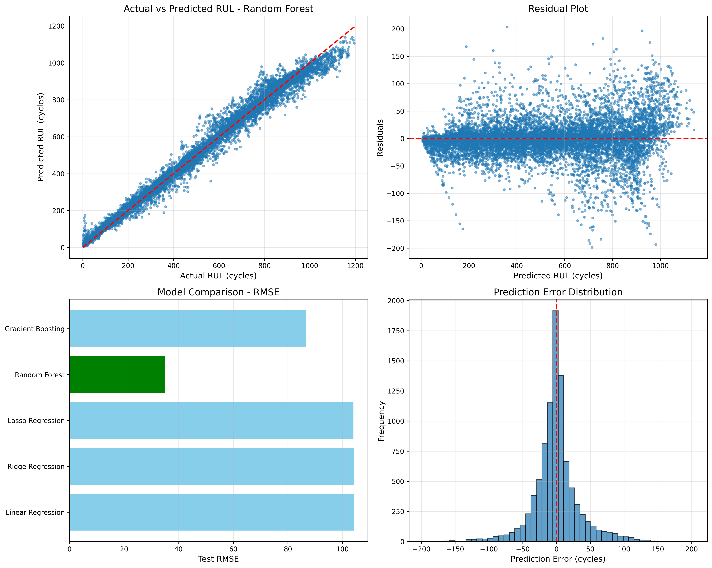
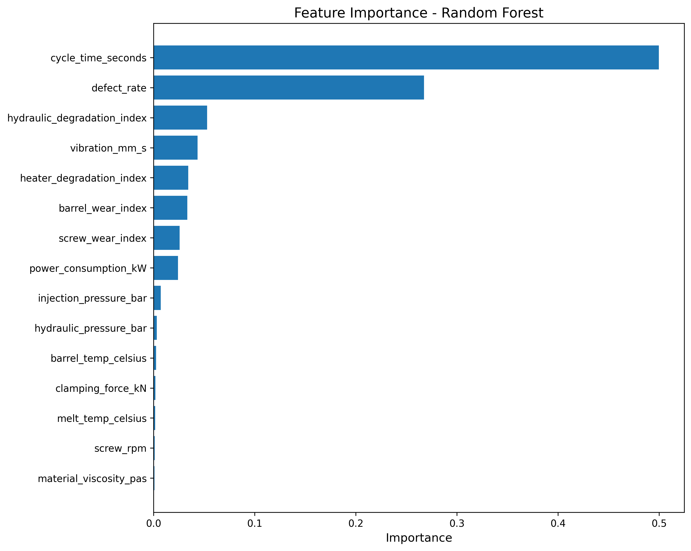

<div align="center">

# Injection Molding Machine — RUL Prediction

**Predict Remaining Useful Life of injection molding machines using Machine Learning**

[](https://python.org)
[](https://scikit-learn.org)
[](LICENSE)

<br>



</div>

---

## About

This project provides a complete **Remaining Useful Life (RUL)** prediction system for injection molding machines. It simulates realistic component degradation, trains multiple ML models, and delivers actionable maintenance recommendations.

| Metric | Value |
|--------|-------|
| **Best Model** | Random Forest |
| **Test R²** | 0.9850 |
| **Test RMSE** | 34.94 cycles |
| **Test MAE** | 22.78 cycles |
| **Dataset Size** | 47,211 samples |

---
## Dataset Details

The synthetic dataset simulates **50 injection molding machines** operating until failure. Each machine record includes:

**Process Parameters** — injection pressure, barrel temperature, cycle time, clamping force, screw RPM, melt temperature, hydraulic pressure, power consumption

**Condition Indicators** — vibration, defect rate, screw/barrel/heater/hydraulic wear indices

**Environmental** — ambient temperature, material viscosity, shot size

**Degradation Model** — Component wear follows a quadratic acceleration curve near failure:
- Screw wear increases injection pressure and reduces RPM
- Barrel wear destabilizes melt temperature
- Heater degradation reduces temperature control precision
- Hydraulic degradation causes erratic clamping force

---

## Quick Start

### 1. Clone & Install

```bash
git clone https://github.com/trainOwn/Injection-Molding-Machine-RUL-Prediction.git
cd Injection-Molding-Machine-RUL-Prediction
pip install -r requirements.txt
```

### 2. Run Predictions (uses pretrained model)

```bash
python predict_rul.py --demo
```

### 3. Train from Scratch

```bash
# Generate a fresh synthetic dataset
python generate_injection_molding_rul_data.py

# Train all models and select the best
python train_rul_model.py
```

### 4. Batch Prediction

```bash
python predict_rul.py --csv your_data.csv --output predictions.csv
```

---

## Python API

```python
from predict_rul import RULPredictor

predictor = RULPredictor()

# Single prediction
rul = predictor.predict_single({
    'injection_pressure_bar': 82.5,
    'barrel_temp_celsius': 232.0,
    'cycle_time_seconds': 46.2,
    'clamping_force_kN': 508.0,
    'screw_rpm': 98.5,
    'melt_temp_celsius': 242.0,
    'hydraulic_pressure_bar': 153.0,
    'power_consumption_kW': 26.5,
    'vibration_mm_s': 0.6,
    'defect_rate': 0.015,
    'ambient_temp_celsius': 24.0,
    'material_viscosity_pas': 1000.0,
    'shot_size_grams': 100.0,
    'screw_wear_index': 0.08,
    'barrel_wear_index': 0.06,
    'heater_degradation_index': 0.04,
    'hydraulic_degradation_index': 0.03
})

print(f"Predicted RUL: {rul:.0f} cycles")

# Maintenance recommendation
status, recommendation = predictor.maintenance_recommendation(rul)
print(f"{status}: {recommendation}")
```

---

## Maintenance Thresholds

| Status | RUL Range | Action |
|--------|-----------|--------|
| HEALTHY | > 150 cycles | Normal operation — continue monitoring |
| WARNING | 50–150 cycles | Schedule maintenance within 1 week |
| CRITICAL | <= 50 cycles | **Immediate maintenance** (24–48 hrs) |

---

## Models Compared

Five regression models are trained and evaluated automatically:

| Model | Test RMSE | Test MAE | Test R² |
|-------|-----------|----------|---------|
| **Random Forest** | **34.94** | **22.78** | **0.9850** |
| Gradient Boosting | 42.31 | 28.65 | 0.9780 |
| Ridge Regression | 104.52 | 82.41 | 0.8660 |
| Linear Regression | 104.53 | 82.42 | 0.8659 |
| Lasso Regression | 108.17 | 86.08 | 0.8564 |

---

## Feature Importance

<div align="center">

</div>

| Rank | Feature | Importance |
|------|---------|------------|
| 1 | Cycle time | 49.98% |
| 2 | Defect rate | 26.74% |
| 3 | Hydraulic degradation index | 5.30% |
| 4 | Vibration | 4.35% |
| 5 | Heater degradation index | 3.42% |

---

## Customization

<details>
<summary><b>Change dataset size</b></summary>

```python
# In generate_injection_molding_rul_data.py
simulator = InjectionMoldingSimulator(num_machines=100)
```
</details>

<details>
<summary><b>Tune model hyperparameters</b></summary>

```python
# In train_rul_model.py
'Random Forest': RandomForestRegressor(
    n_estimators=200,
    max_depth=25,
    random_state=42
)
```
</details>

<details>
<summary><b>Adjust maintenance thresholds</b></summary>

```python
status, rec = predictor.maintenance_recommendation(
    rul,
    threshold_critical=30,
    threshold_warning=100
)
```
</details>

---

## Future Work

- Multi-output prediction (failure mode classification)
- Real-time monitoring dashboard
- LSTM / RNN models for time-series patterns
- Anomaly detection for unexpected failures
- Transfer learning for new machine types

---

## Requirements

- Python 3.8+
- NumPy
- Pandas
- scikit-learn
- Matplotlib
- Seaborn
- Joblib

---

## License

This project is for **educational and demonstration purposes**.

---

<div align="center">
<sub>Built for predictive maintenance in injection molding applications</sub>
</div>
